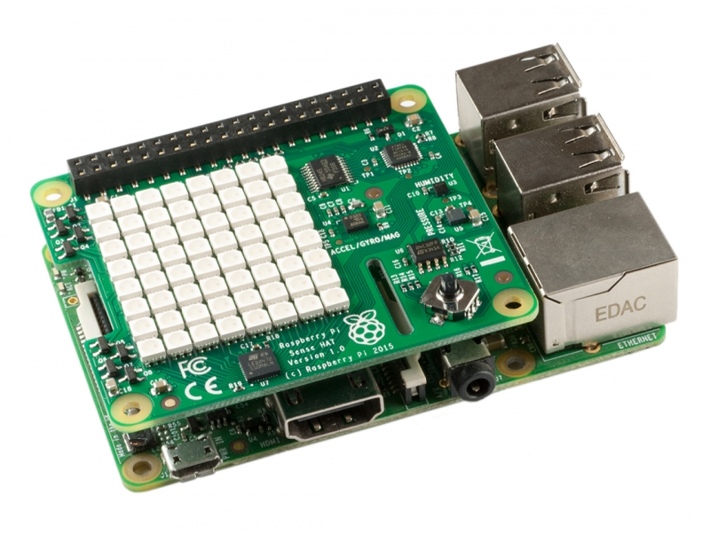
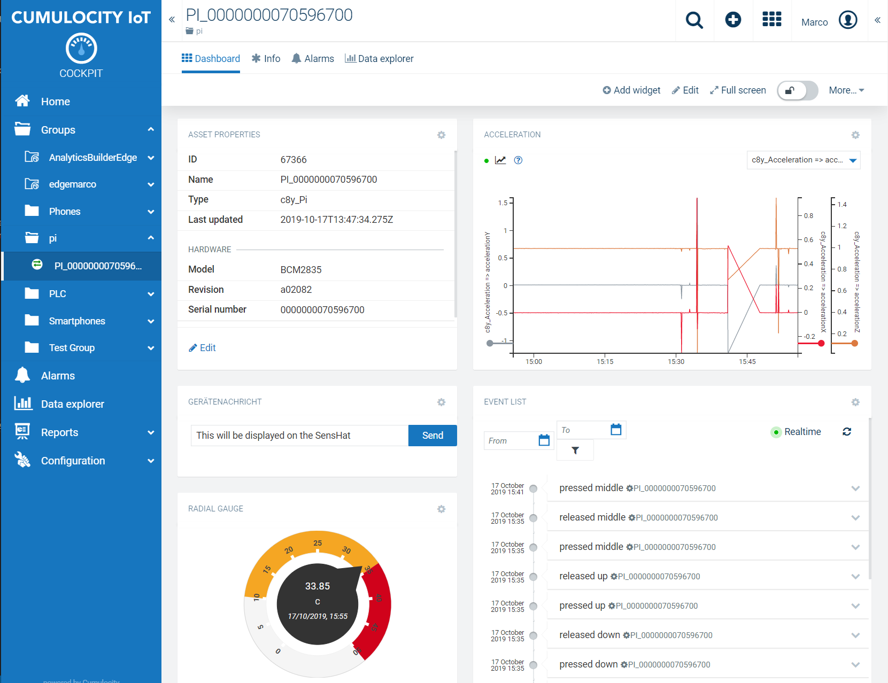

# Cumulocity IoT Python3 Agent

c8yMQTT is a Python3 Cumulocity Agent for MQTT and Rasperry PI. The Cumulocity Python agent is divided into two Python modules. C8yMQTT is sort of a small SDK that wraps a lot of functionality into function calls. piAgent.py Module leverages C8yMQTT.py to implement device specific functions such as sending measurements, updating configurations and more. 

To use this agent, you may sign up for free trial tenant at [Cumulocity](http://cumulocity.com/)

The Raspberry Pi including the SensHat Sensor Array is a great starting point for rapid prototyping.

Cumulocity IoT enables companies to to quickly and easily implement smart IoT solutions. 

______________________
For more information you can Ask a Question in the [TECHcommunity Forums](http://tech.forums.softwareag.com/techjforum/forums/list.page?product=webmethods-io-b2b).

You can find additional information in the [Software AG TECHcommunity](http://techcommunity.softwareag.com/home/-/product/name/webmethods-io-b2b).
______________________

These tools are provided as-is and without warranty or support. They do not constitute part of the Software AG product suite. Users are free to use, fork and modify them, subject to the license agreement. While Software AG welcomes contributions, we cannot guarantee to include every contribution in the master project.

Contact us at [TECHcommunity](mailto:technologycommunity@softwareag.com?subject=Github/SoftwareAG) if you have any questions.

## C8yMQTT Class

The class C8yMQTT let's you connect your device to the Cumulocity Cloud using mqtt. It provides basic methods to:

* Connect to a cumulocity tenant via mqtt (tls supported)
* Register a device, fetch credentials and store them on the device
* Subscribe to MQTT Topics
* Send and receive MQTT Messages

## piAgent.py Module

To implement a Cumulocity Device Agent you have to cater the C8yMQTT class with device specific functionality (Send Measurements etc.). piAgent.py provides a sample implementation for the Raspberry PI 3.

## Prerequisites for Raspbian distribution

#### Enable SPI Interface

edit /boot/config.txt and enable
dtparam=spi=on

#### Python3
 
sudo apt-get install python3-pip  
sudo apt-get install python3  
sudo apt-get install python-dev python3-dev  
sudo apt-get install ca-certificates  
sudo apt-get install sense-hat
pip3 install paho-mqtt 

echo "alias python='/usr/bin/python3'" >>  ~/.bashrc

# Getting Started

## Configure the Cumulocity Tenant

The used MQTT SmartREST Template for the piAgent is created by the agent itself. If there is a new version of the Agent deployed it is good practice to delete the SmartRest Template via Devicemanagement -> Device types -> SmartREST templates. This will make sure that the latest SmartRest template is used.

### Register Device

__c8y.properties__  
c8yMQTT will create and store the device credentials file c8y.properties in the same directory as the class. It can be created to provide manual credentials. Remove this file in order to initiate a new auto registration process.

!!!PLEASE MAKE SURE THAT THE DEVICE IS NOT ALREADY REGISTERED WITH IT'S SERIAL NUMBER!!!
If that is the case either you have to delete the device and re-register or create the c8y.properties by hand and provide correct credentials and client id.

  
[credentials]  
user =  
tenant =   
password =   
clientid =

If not present the initialized variable is false and the registerDevice method can be used to fetch new credentials. 

To autoregister your pi got to In Cumulocity -> Device Management create a new Device Registration entering the serial (could be retrieved by cat /proc/cpuinfo) of your PI. The c8y.properties file will be created automatically. For this the bootstrap_pwd in pi.properties must be set.
If the 

__pi.properties__

the pi.properties file holds device specific parameters.
* host -> Mqtt host (works for cumulocity.com do not change except you running on another instance of Cumulocity )
* port -> Mqtt port it'll be set either to 1883 for tcp or to 8883 for  Transport Encryption via TLS
* tls -> Boolean which indicates whether to use tls or not. Must match the port settings
* cacert -> path to a certificate (pem format) that holds all trusted root certificates
* operations -> all supported operations of the agent which are implemented in an agent module
* subscribe -> Topics the agent will subscribe to.
* deviceType -> speaks for itself
* sendinterval -> Loop time of the RunAgent() function. Indicates in which time frame measurements etc. are read and send
* requiredinterval -> Sets the time frame in which the device must contact the platform in order to be displayed connected. 
* Loglevel -> speaks for itself
* reboot -> will be set by the restart device command to prevent from a infinite loop.
* config_update -> same as reboot
* bootstrap_pwd -> needed for auto registration process
*  

### Agent Run
Checkout the project. For testing just run:  
python3 piAgent.py  
 

### Agent Install
The Agent supports a few operations like Reload Configuration / Save Configuration and Restart. In order to work these operators need to perform a restart. This is done via a systemd service which has to be registered.

Execute install.sh (You need sudo rights).  
A service called c8y will be registered with systemd

### Build in functions

The Agent supports the following functions:

* Configuration -> The content of pi.properties will be displayed under Device Management and can be save to the device
* Restart -> The Raspberry PI an be rebooted via the restart command.
* Send Message to the Device -> Via the Send Message Widget in the Cockpit Application. Text can be send to the PI and will be displayed on the SensHats LED  Matrix
* Transmitted Measurements -> Temperature, Gyroscope, Acceleration, Pressure, Humidity
* Joystick -> Events are created on pressing. If the joystick is pressed three times the PI will start a new registration process. This comes in handy if you have to move it to another tenant.

### Docker Support 
PC Agent and PI Agent can run within Docker. Dockerfiles can be used to build an image:

Build - PC:
docker build -t pcagent -f ./Dockerfile.pcAgent .

Build - Raspberry Pi:
docker build -t piagent -f ./Dockerfile.piAgent .

Run - PC:
docker run -it -v $PWD:/usr/src/app pcagent

Run - Raspberry Pi:
docker run -it -v $PWD:/usr/src/app --privileged=true piagent
